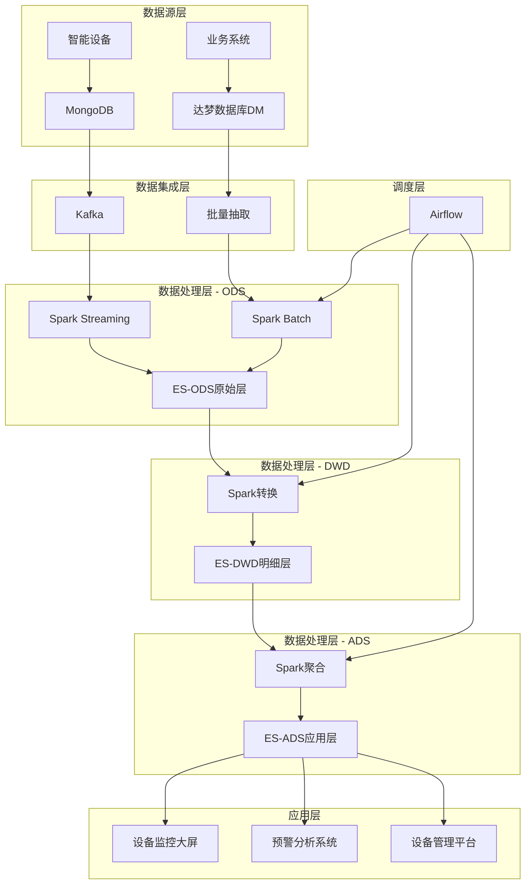

# 城市大脑-智能设备运行监管系统-大数据分析

## 简介
城市大脑智能设备运行监管系统旨在通过大数据技术处理城市智能设备产生的海量数据，实现对设备的全生命周期监控、性能分析及智能预警。系统通过多层数据处理为城市管理者提供设备运行状态、性能趋势和异常预警等关键指标，提升智慧城市管理效能

## 硬件设备
| 数量 |  存储引擎 |  计算引擎 |  调度引擎 |
| --- |   ---    |  ---     | ---     |
|  3台(8CPU/16GB/3T)   |   ES(3×6GB, 数据节点+主资格节点) |  Spark(3×6GB) | 无 | 
|  2台(8CPU/32GB/500G)   |  ES(2×6GB, 数据节点+协调节点)、Kafka(2×6GB)  | Spark(2×10GB) | Airflow(2×3GB)、postgres(1×2GB) |

## 系统架构
### 数据规模与特点
- 日增数据量：约500万条
- 累计数据量：10亿级别
- 数据类型：结构化数据(达梦数据库)和非结构化数据(MongoDB)
- 实时性需求：大部分聚合数据无实时性要求，小部分有实时性要求(秒级到分钟级)

### 数据流程图

### 数据分层策略
- ODS层(原始数据层)
    ```
    保存原始数据，最小粒度
    数据格式标准化，无业务处理
    保留期：永久
    ```
- DWD层(明细数据层)
    ```
    业务维度划分
    字段规范化和标准化处理
    数据质量控制
    保留期：90天
    ```
- ADS层(应用数据层)
    ```
    面向应用的聚合视图
    预计算多维指标
    按业务主题组织
    保留期：365天
    ```

### 核心组件详解
#### 数据源
- MongoDB
    ```
    存储智能设备产生的非结构化和半结构化数据
    支持高吞吐的写入操作
    灵活的文档模型适合设备数据变化
    ```
- 达梦数据库(DM)
    ```
    存储业务系统的结构化数据
    支持标准SQL接口
    提供数据安全和事务保证
    数据传输与缓冲
    ```
- Kafka
    ```
    作为实时数据管道，支持高吞吐消息传递
    解耦数据生产和消费
    实现数据缓冲，削峰填谷
    配置3个分区，确保并行处理能力
    ```

#### 计算引擎
- Spark
    ```
    统一的批处理和流处理引擎
    流处理使用微批模式，批处理窗口设置为1分钟
    资源动态分配，根据任务复杂度调整
    使用RDD缓存优化重复计算
    ```

#### 存储引擎
- Elasticsearch
    ```
    作为数据仓库的统一存储引擎
    支持复杂的多维聚合查询
    提供近实时搜索能力
    通过索引生命周期管理数据保留策略
    ```
#### 任务调度
- Airflow
    ```
    管理批处理作业的定时执行
    支持复杂的DAG工作流
    提供任务依赖关系管理
    作业失败自动重试和告警
    ```

## 部署方案
### Docker Swarm部署
系统采用Docker Swarm作为容器编排平台，提供轻量级的服务编排和容器管理能力。

1. 初始化集群
```bash
# 在主节点初始化Swarm集群
docker swarm init --advertise-addr <MANAGER-IP>

# 工作节点加入集群
docker swarm join --token <WORKER-TOKEN> <MANAGER-IP>:2377
```

2. 服务部署

```yaml
# docker-compose.yml
version: '3.8'

services:
  elasticsearch:
    image: elasticsearch:8.7.0
    environment:
      - node.name=node-${NODE_ID}
      - cluster.name=city-brain
      - discovery.seed_hosts=elasticsearch-1,elasticsearch-2,elasticsearch-3,elasticsearch-4,elasticsearch-5
      - cluster.initial_master_nodes=node-1,node-2,node-3
      - bootstrap.memory_lock=true
      - ES_JAVA_OPTS=-Xms6g -Xmx6g
    volumes:
      - es-data:/usr/share/elasticsearch/data
    deploy:
      resources:
        limits:
          cpus: '4'
          memory: 4G
      placement:
        constraints:
          - ${NODE_CONSTRAINT}
    networks:
      - elk_network

  kafka:
    image: confluentinc/cp-kafka:7.3.0
    environment:
      - KAFKA_NODE_ID=${NODE_ID}
      - KAFKA_CONTROLLER_QUORUM_VOTERS=1@kafka-1:9093,2@kafka-2:9093,3@kafka-3:9093
      - KAFKA_PROCESS_ROLES=broker,controller
      - KAFKA_LISTENER_SECURITY_PROTOCOL_MAP=PLAINTEXT:PLAINTEXT,CONTROLLER:PLAINTEXT
      - KAFKA_ADVERTISED_LISTENERS=PLAINTEXT://${HOSTNAME}:9092
      - KAFKA_CONTROLLER_LISTENER_NAMES=CONTROLLER
      - KAFKA_LISTENERS=PLAINTEXT://:9092,CONTROLLER://:9093
      - KAFKA_LOG_DIRS=/var/lib/kafka/data
    volumes:
      - kafka-data:/var/lib/kafka/data
    deploy:
      resources:
        limits:
          cpus: '2'
          memory: 4G
      placement:
        constraints:
          - node.labels.disk==high
    networks:
      - kafka_network

  spark-master:
    image: apache/spark:3.4.0
    command: "/bin/bash -c 'bin/spark-class org.apache.spark.deploy.master.Master'"
    ports:
      - "8080:8080"
      - "7077:7077"
    deploy:
      resources:
        limits:
          cpus: '2'
          memory: 4G
      placement:
        constraints:
          - node.labels.memory==high
    networks:
      - spark_network

  spark-worker:
    image: apache/spark:3.4.0
    command: "/bin/bash -c 'bin/spark-class org.apache.spark.deploy.worker.Worker spark://spark-master:7077'"
    depends_on:
      - spark-master
    environment:
      - SPARK_WORKER_CORES=${WORKER_CORES}
      - SPARK_WORKER_MEMORY=${WORKER_MEMORY}
    deploy:
      mode: global
      resources:
        limits:
          cpus: '${WORKER_CORES}'
          memory: ${WORKER_MEMORY}
    networks:
      - spark_network

  airflow:
    image: apache/airflow:2.6.0
    depends_on:
      - spark-master
    environment:
      - AIRFLOW__CORE__EXECUTOR=LocalExecutor
      - AIRFLOW__CORE__SQL_ALCHEMY_CONN=sqlite:////opt/airflow/airflow.db
      - AIRFLOW__WEBSERVER__SECRET_KEY=airflow-secret
    volumes:
      - airflow-dags:/opt/airflow/dags
      - airflow-logs:/opt/airflow/logs
    ports:
      - "8081:8080"
    deploy:
      resources:
        limits:
          cpus: '2'
          memory: 4G
      placement:
        constraints:
          - node.labels.memory==high
    networks:
      - airflow_network
      - spark_network

networks:
  elk_network:
    driver: overlay
  kafka_network:
    driver: overlay
  spark_network:
    driver: overlay
  airflow_network:
    driver: overlay

volumes:
  es-data:
  kafka-data:
  airflow-dags:
  airflow-logs:
```

## 性能优化与扩展策略
### 数据处理优化
数据预聚合:

- 实时层面：使用滑动窗口聚合
- 批处理层面：预计算多维指标
- 时间维度：小时级、天级聚合

#### 数据分区策略:

- ES索引按日或周分区
- Kafka topic根据设备类型分区
- Spark作业数据分区与集群资源匹配

### 扩展性考虑
#### 水平扩展计划:

- 当设备数据量超过现有处理能力，可增加节点
- ES集群可独立扩展存储节点
- Spark集群可独立增加计算节点

#### 资源动态调整:

- 根据业务高峰低谷动态调整资源分配
- 非关键时段数据处理可降低优先级

## 监控与运维
### 监控系统
1. 部署监控系统
```bash
docker stack deploy -c monitoring.yml monitoring
```

2. 监控范围包括:
```
硬件资源监控：CPU、内存、磁盘、网络
应用性能监控：ES查询响应时间、Spark任务完成时间
数据处理监控：数据延迟、处理量、错误率
告警机制
设置多级告警阈值，从警告到严重
集成短信、邮件、企业微信告警通道
关键指标：处理延迟、错误率、资源使用率
备份策略
ES数据：快照备份到远程存储
配置文件：版本控制管理
运行日志：集中存储并定期归档
```

## 未来演进规划
### 扩展数据源

- 接入更多类型的智能设备
- 整合视频监控数据
- 接入第三方城市数据

### 增强分析能力

- 引入机器学习模型进行设备异常检测
- 开发预测性维护功能
- 增加复杂事件处理能力

### 架构演进

- 根据业务增长评估迁移至Kubernetes
- 考虑引入数据湖架构处理更多历史数据
- 探索Lambda架构向Kappa架构的转变

这套方案综合考虑了现有硬件条件和业务需求，构建了一个平衡性能与资源的大数据处理系统，能够满足智能设备监管的各项需求，同时预留了未来扩展的空间。
